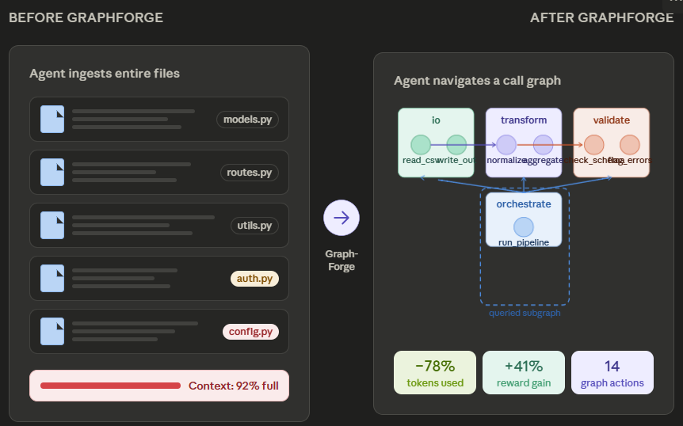

# Teaching an AI to Think in Graphs, Not Files

_How GraphForge trains coding agents to navigate codebases the way senior engineers actually do_

---

Your IDE has a "Find All References" button. You use it constantly. You never open every file in the project and grep through them manually.

Current AI coding agents do exactly that and they're paying for it.

---

## The Problem: Agents Are Reading Too Much

Today's best coding agents work file by file. They ingest your entire `utils.py`, your `models.py`, your `routes.py` all of it just to answer the question _"which functions call `authenticate_user`?"_.

This creates a painful compounding problem:

By turn 30 of a non-trivial task, a small model has burned most of its context window on code it already looked at. It's not planning anymore it's just trying to remember what it read three pages ago.

The result? **Token bloat. Missed errors. Expensive API bills.** And an agent that can't see the forest for the trees.

The real insight is that most structural questions about a codebase dependency tracing, fan-in analysis, module responsibility are _graph problems_. And graphs are an order of magnitude more efficient to query than raw text files.

---

## The Fix: Train Agents to Work on the Graph

**GraphForge** is a reinforcement learning environment that trains agents to edit a _graph representation_ of a codebase instead of its files.

Here's the mental model: instead of handing the agent a folder of `.py` files, we hand it a **Directed Acyclic Graph** nodes are functions, edges are calls between them, and modules group related nodes together. The agent never sees noisy file contents it doesn't need. It sees only the subgraph relevant to the task.

The agent's job is to construct, explore, and refine this graph until it satisfies a coding architecture task then _materialize_ it into real, runnable Python source files and submit for scoring.



---

## Inside the Environment: What the Agent Sees, Does, and Earns

### What the agent sees

Every step, the agent receives a `GraphObservation` a structured snapshot containing:

- The current call graph (modules → functions → edges)
- Which architectural constraints it's already satisfied
- How many tokens and turns it has left
- The result of its last action

It doesn't receive a wall of code. It receives _signal_.

### What the agent can do

The agent has a vocabulary of **14 actions**, split between mutation and exploration:

**Build the graph:**

- `add_module` / `add_node` / `add_edge` construct the architecture
- `attach_body` attach real code templates to functions
- `set_node_module` reorganize functions across modules

**Explore before committing:**

- `query_subgraph` fetch just the neighbors of a node
- `query_types` inspect signatures and catch type mismatches early
- `query_spec` check which constraints are already satisfied

**Validate and submit:**

- `materialize_and_validate` render the graph to Python and run mypy
- `run_behavioral_tests` run pytest against the materialized code
- `submit` end the episode and collect the final reward

Failed mutations are **automatically rolled back** the environment snapshots the graph before every action, so the agent can experiment without fear of corrupting state it can't recover.

### What the agent gets rewarded for

The reward function is designed to make the agent genuinely useful, not just prompt-compliant:

**Every step costs something** (−0.1 base + token cost). Wasted turns are penalized.

**Bad behavior costs more:**

- Repeated actions: −1.0
- Malformed actions: −2.1
- Failed mutations: −0.6

**Quality at submission pays well:**

- Each architectural constraint satisfied: +1.0
- All constraints satisfied: +5.0 bonus
- Each behavioral test passed: +3.0
- All tests pass: +5.0 bonus
- Clean output: +3.0
- LLM Token efficiency (if everything passes): up to +5.0

The incentive structure pushes the agent toward _targeted exploration and clean architecture_, not brute-force trial and error.

---

## Proven Gains: Training GRPO on a Small Model

We trained **Qwen2.5-3B-Instruct** using **GRPO (Group Relative Policy Optimization)** with LoRA fine-tuning (r=16, α=32).

The setup: collect 4 rollouts per task, score each with the environment's graduated reward, then update using group-relative advantages. LoRA keeps the parameter count manageable and the pretrained weights largely intact.

Training ran over 25 steps across a diverse set of tasks tier 1 (single-module pipelines), tier 2 (3-module ETL and event routing), and tier 3 (5–7 module systems like microservices and plugin architectures).

---

## Results: What Actually Changed

> **Baseline → Trained: mean shaped reward +1.442 → +2.033 (Δ +0.592, ~41% relative gain)**

That's the headline. But the per-seed breakdown tells a richer story:

| Eval Seed | Baseline | Trained | Δ         |
| --------- | -------- | ------- | --------- |
| 101       | ~1.30    | ~1.30   | 0         |
| 202       | ~1.05    | ~1.30   | +0.25     |
| **303**   | ~1.30    | ~3.50   | **+2.20** |
| 404       | ~2.40    | ~2.40   | 0         |
| 505       | ~1.30    | ~1.30   | 0         |
| **606**   | ~1.30    | ~2.40   | **+1.10** |

Four of six seeds improved. The two that didn't move (seeds 404 and 101/505) were either already near-ceiling or consistently hard the baseline had already saturated seed 404 at ~2.4, leaving little headroom.

Seeds 303 and 606 showed the largest absolute gains these are mid-complexity tasks where the agent learned to exploit the graph structure most effectively.

**The reward distribution widened significantly.** The trained model's interquartile range expanded from a tight cluster around 1.3 to a spread of roughly 1.3–2.4, with a high outlier at 3.5. The model learned strong policies for certain task families while harder tasks remain at baseline a clear signal that more training steps and a curriculum that up-weights harder seeds would tighten the distribution further.

The KL divergence from the reference policy stayed well below 0.01 per token for most of training, with one brief spike to ~0.07 at steps 19–20 that self-corrected within a single update. The policy improved without drifting.

---

## Why Does This Matter?

### For AI researchers

GraphForge is a **structured reasoning benchmark** that rewards correct dependency modeling, type consistency, and modular design not just token prediction. It's a cleaner signal than "did the code run" because it measures _why_ code is correct.

### For developers building coding agents

The graph-as-interface paradigm is a genuine architectural alternative to file-ingestion. If you're building agents for large codebases, the token cost of file-level context is a real ceiling. Graph-level context is the path around it.

### For the broader RL-for-code community

The environment exposes **hidden constraints** architectural rules the agent isn't told about to separate agents that generalize from agents that memorize. This is a more honest evaluation than full-visibility benchmarks.

---

## Try It Yourself

| Resource                 | Link                                                                                                                                                                                         |
| ------------------------ | -------------------------------------------------------------------------------------------------------------------------------------------------------------------------------------------- |
| 🤗 **Live Demo**         | [HuggingFace Space GraphForge](https://huggingface.co/spaces/TarunGopinath/OpenENV-GraphForge)                                                                                               |
| 💻 **Source Code**       | [GitHub TarunGopinath6/OpenENV-GraphForge](https://github.com/TarunGopinath6/OpenENV-GraphForge)                                                                                             |
| 📓 **Training Notebook** | [Open on HuggingFace - /results/grpo_lora_graphforge - final.ipynb](https://huggingface.co/spaces/TarunGopinath/OpenENV-GraphForge/blob/main/results/grpo_lora_graphforge%20-%20final.ipynb) |

```bash
# Reproduce training locally
pip install -e ".[training]"
python -m training.train --model Qwen/Qwen2.5-3B-Instruct --epochs 3

# Quick smoke-test (no GPU needed)
python -m training.train --dry-run
```

---

_Built for the [Meta PyTorch OpenEnv Hackathon × Scaler School of Technology](https://www.scaler.com/school-of-technology/meta-pytorch-hackathon)._
