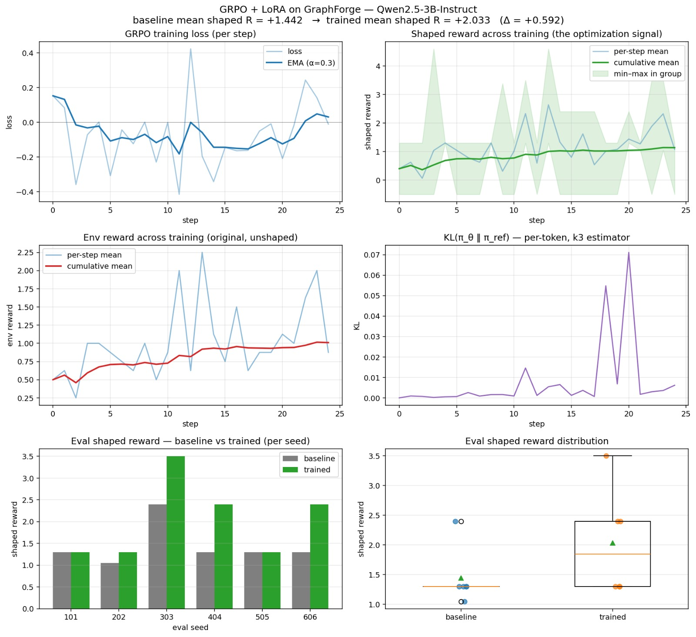

# GraphForge

**A graph-first code-editing RL environment for Python repositories, built on [OpenEnv](https://github.com/meta-pytorch/OpenEnv).**

|                       |                                                                                                                                                                                             |
| --------------------- | ------------------------------------------------------------------------------------------------------------------------------------------------------------------------------------------- |
| **GitHub**            | https://github.com/TarunGopinath6/OpenENV-GraphForge                                                                                                                                        |
| **HuggingFace Space** | [TarunGopinath/OpenENV-GraphForge](https://huggingface.co/spaces/TarunGopinath/OpenENV-GraphForge)                                                                                          |
| **Training notebook** | [Open in HuggingFace - /results/grpo_lora_graphforge -final.ipynb](https://huggingface.co/spaces/TarunGopinath/OpenENV-GraphForge/blob/main/results/grpo_lora_graphforge%20-%20final.ipynb) |
| **Blog**              | [BLOG.md](./BLOG.md)                                                                                                                                                                        |

---

## 1. The Problem

The current powerful coding agents make code changes file by file, and ingest large files to gain context and reason. This has a lot of noise, and thus causes the following problems:

- **Token bloat:** By turn 30 of a non-trivial task, a small model burns most of its context on already-written code, not planning.
- **Implicit structure:** "Which functions call this one?" requires re-parsing every file. These are an order of a magnitude simpler on a graph than on text.
- **Excessive cost:** With higher token spending, limits get exhausted and API credits burn a hole in your pocket.
- **Deferred error signal:** A wrong implementation propagates silently until the full program is run.

## 2. Our Fix

**GraphForge** is an Reinforcement Learning Environment that trains Agents to edit a graph representation of the codebase instead of files.

Code is represented as a Directed Acyclic Graph (DAG) that obtains the entities from the codebase like modules, classes, functions and external dependencies. Only the required subgraph from this and the user query are sent as context to the Agent.

The Agent can query more nodes, and explore the graph or manipulate by adding, modifying or deleting nodes, to get the result they're instructed to. They do this in a loop with an upper bound on tokens and turns.

This trains the Agent to explore a codebase using this graph, to store only information rich context and not noise, while improving structured reasoning and output efficiency as it generates only the code snippet that's required for the manipulation option.


## 3. Environment

GraphForge is an **OpenEnv-compliant reinforcement-learning environment** ([`GitHub - OpenEnv`](https://github.com/meta-pytorch/OpenEnv)) where the agent incrementally **constructs a DAG Python call graph** to satisfy a code-architecture task, then materializes it to real Python source files for scoring.

Each episode follows:

```
reset(tier, task_id?) → GraphObservation
    ↓
step(GraphAction) → GraphObservation    (repeat up to turn_cap times)
    ↓
submit → terminal GraphObservation with final reward
```

Two hard budget limits - **turn cap** and **token budget** - bound every episode.

### Architecture

```
┌──────────────────────────────────────────┐
│  Agent (Qwen2.5-3B)                    │
│  reasons over GraphObservation           │
│  emits one GraphAction per step          │
└──────────────────┬───────────────────────┘
                   │ GraphAction(action_type, parameters)
                   ▼
┌──────────────────────────────────────────────────────────────────────┐
│  GraphForgeEnvironment                                               │
│  ────────────────────────────────────────────────────────────────── │
│   ActionDispatcher  (snapshot → dispatch → rollback on failure)      │
│   ├─ TypeEngine          - signature parsing, edge type-compat check │
│   ├─ BodyTemplateLibrary - named code-gen templates (identity, …)   │
│   ├─ Materializer        - GraphState → Python source files          │
│   ├─ Validator           - ast.parse + mypy subprocess               │
│   ├─ BehavioralTestRunner - pytest in isolated tempdir               │
│   ├─ ConstraintChecker   - 20+ structural & behavioral constraints   │
│   ├─ RewardEngine        - per-turn + terminal reward                │
│   └─ TokenCounter        - tracks action + observation token cost    │
│                                                                      │
│  GraphForgeState                                                     │
│   └─ GraphState: modules · nodes (functions) · edges (call-edges)   │
└──────────────────────────────────────────────────────────────────────┘
                   │ GraphObservation
                   ▼
           graph_state, constraint_summary, last_action_result,
           visible_constraints, available_actions, token/turn budgets
```

### Action vocabulary (14 total)

**Mutation actions** - failed mutations are automatically rolled back:

| Action            | What It Does                                              |
| ----------------- | --------------------------------------------------------- |
| `add_module`      | Declare a new module with a responsibility tag            |
| `remove_module`   | Remove a module (fails if nodes remain)                   |
| `add_node`        | Add a typed function to a module                          |
| `remove_node`     | Remove a function (fails if edges remain)                 |
| `set_node_module` | Move a function to a different module; edges follow       |
| `attach_body`     | Attach a code-gen body template to a function             |
| `add_edge`        | Add a typed call-edge; validates types, checks for cycles |
| `remove_edge`     | Remove a call-edge                                        |

**Information / control actions** - read-only, no rollback needed:

| Action                     | What It Does                                          |
| -------------------------- | ----------------------------------------------------- |
| `query_spec`               | Check visible constraint satisfaction status          |
| `query_subgraph`           | Fetch nodes/edges by module, neighbors, or path scope |
| `query_types`              | Inspect signatures; flags `Any` contamination         |
| `materialize_and_validate` | Render graph to Python source + run mypy              |
| `run_behavioral_tests`     | Run pytest against the materialized source            |
| `submit`                   | End the episode; trigger final scoring                |

### Reward structure

**Per Step:**

| Event                         | Delta                     |
| ----------------------------- | ------------------------- |
| Base step cost                | −0.1                      |
| Token cost                    | −0.001 × tokens_this_turn |
| Successful non-repeat action  | +0.05 (net −0.05)         |
| Failed mutation               | −0.5 (net −0.6)           |
| Repeat action (type + params) | −1.0                      |
| Malformed / unknown action    | −2.1                      |

**Terminal (applied once at `submit`):**

| Component                                              | Value        |
| ------------------------------------------------------ | ------------ |
| Materialization fails                                  | −8.0 to −4.0 |
| Each visible structural constraint satisfied           | +1.0         |
| All visible structural constraints satisfied           | +5.0 bonus   |
| Each behavioral test passed                            | +3.0         |
| All behavioral tests passed                            | +5.0 bonus   |
| mypy passes with zero errors                           | +3.0         |
| Token efficiency (only if all structural + tests pass) | up to +5.0   |

## 4. Training

We use **GRPO (Group Relative Policy Optimization)** with LoRA fine-tuning ([`training/train.py`](./training/train.py)):

1. **Baseline eval** - run untrained model on all tasks; record pass rate
2. **GRPO** - collect G=4 rollouts per task, score with graduated reward, train with group-relative policy optimization + LoRA (r=16, α=32)
3. **Trained eval** - re-evaluate; compare with baseline
4. **Plots** - reward curve, loss curve, before/after comparison

```bash
# Reproduce locally
pip install -e ".[training]"
python -m training.train --model Qwen/Qwen2.5-3B-Instruct --epochs 3

# Quick smoke-test (no GPU needed)
python -m training.train --dry-run
```

## 5. Results



**Baseline → Trained: mean shaped reward +1.442 → +2.033 (Δ +0.592, ~41% relative gain) - Qwen2.5-3B-Instruct**

The six-panel diagnostic below covers the full training run on a single GPU.

---

### (A) GRPO training loss

The policy gradient loss oscillates around zero by design: positive values push the policy toward above-group-mean completions, negative values push it away from below-mean ones, and exactly zero means all completions in the group tied - no gradient signal that step. The EMA (α = 0.3) hovers between −0.2 and 0 for most of training, consistent with a healthy but noisy GRPO run. The spike to +0.42 around step 12 corresponds to a group where a single high-reward sample dominated, creating a temporarily large positive advantage; the EMA absorbs it within a few steps. What matters is that the EMA doesn't trend strongly positive (policy collapsing onto a degenerate mode) or strongly negative (policy pushing away from the only reward-positive samples). Both are satisfied here.

---

### (B) Shaped reward during training

The cumulative mean shaped reward (green) rises from ~0.5 to ~1.2 across 25 steps - a monotone upward trend despite the noisy per-step signal. More informative is the **widening min-max band** in later steps: the gap between the best and worst completions within a GRPO group grows substantially, which is exactly the regime where GRPO gets strong gradient signal.

---

### (C) Environment reward (unshaped)

The raw environment reward - task success divorced from any shaping bonuses - tracks the shaped signal closely. Its cumulative mean (red) rises from ~0.5 to ~1.0. This is an important sanity check: **reward shaping can sometimes improve the optimization proxy while leaving actual task performance flat.** Here both move together, confirming the gain is real and not an artifact of the shaping function.

---

### (D) KL divergence from reference policy

KL(π_θ ∥ π_ref) stays well below 0.01 per token for the majority of training - indicating the policy is not drifting far from the pretrained weights, which is the intended behavior of the KL penalty in GRPO. The **sharp spike at steps 19–20 (~0.07)** is notable: the policy briefly deviated significantly, then snapped back to near-zero within one update. This pattern typically indicates a high-variance group where one sample received a large reward bonus, causing a momentary large policy step before the KL penalty pulled it back. It did not destabilize training, but it's the kind of event to watch - if the spike had persisted or grown, it would signal the KL coefficient needs tuning upward.

---

### (E) Evaluation: per-seed bars and reward distribution

The eval results reveal **high seed variance**, which is worth flagging explicitly:

| Eval seed | Baseline shaped R | Trained shaped R | Δ         |
| --------- | ----------------- | ---------------- | --------- |
| 101       | ~1.30             | ~1.30            | 0         |
| 202       | ~1.05             | ~1.30            | +0.25     |
| 303       | ~1.30             | ~3.50            | **+2.20** |
| 404       | ~2.40             | ~2.40            | 0         |
| 505       | ~1.30             | ~1.30            | 0         |
| 606       | ~1.30             | ~2.40            | +1.10     |

Four of six seeds improve; two show no lift. The baseline already achieves ~2.4 on seed 404 (an easier task family), leaving less headroom. Seeds 303 and 606 show the largest absolute gains. The **distribution plot (F)** reflects this: the trained model's IQR widens considerably (roughly 1.3 → 2.4), with the median shifting from ~1.3 to ~1.9, and a high outlier at 3.5. The baseline is tightly clustered, meaning the policy learned to exploit high-reward trajectories on favorable tasks but hasn't yet closed the gap on harder ones.

> **Callout - variance vs. mean:** Reporting only the mean (Δ +0.592) understates both the upside and the incompleteness of the result. The wide trained IQR suggests the model is **not yet reliably generalising** - it has found a strong policy for certain task types while others remain at baseline. More training steps or a curriculum that up-weights the harder seeds would likely tighten this distribution.

### Training step log

| step | task_seed | mean_env_reward | mean_shaped_reward | std_shaped_reward | max_shaped_reward | min_shaped_reward | loss      | pg_loss   | kl       | clip_frac | n_tokens | mean_n_mutations | mean_n_turns | grad_norm | updated | step_time_s |
| ---- | --------- | --------------- | ------------------ | ----------------- | ----------------- | ----------------- | --------- | --------- | -------- | --------- | -------- | ---------------- | ------------ | --------- | ------- | ----------- |
| 0    | 99        | 0.5000          | 0.4000             | 0.9621            | 1.3000            | -0.50             | 0.152034  | 0.152034  | 0.000000 | 0.006257  | 2557     | 0.500            | 3.250        | 0.427542  | TRUE    | 92.88       |
| 1    | 196       | 0.6250          | 0.6250             | 0.9316            | 1.3000            | -0.50             | 0.082777  | 0.082739  | 0.000936 | 0.010917  | 1832     | 0.625            | 2.375        | 1.190462  | TRUE    | 68.01       |
| 2    | 109       | 0.2500          | 0.0625             | 0.8245            | 1.3000            | -0.50             | -0.359354 | -0.359383 | 0.000729 | 0.005321  | 5262     | 0.500            | 3.125        | 0.356200  | TRUE    | 148.71      |
| 3    | 11        | 1.0000          | 1.0375             | 1.6928            | 4.6000            | -0.50             | -0.072499 | -0.072507 | 0.000207 | 0.003310  | 17218    | 1.000            | 3.375        | 0.135513  | TRUE    | 413.32      |
| 4    | 67        | 1.0000          | 1.3000             | 1.27e-07          | 1.3000            | 1.30              | 2.14e-05  | 1.19e-07  | 0.000533 | 0.003989  | 2256     | 1.000            | 2.875        | 0.006895  | TRUE    | 70.03       |
| 5    | 132       | 0.8750          | 1.0438             | 0.6299            | 1.3000            | -0.50             | -0.308221 | -0.308248 | 0.000655 | 0.002870  | 1742     | 0.875            | 2.875        | 0.355914  | TRUE    | 64.68       |
| 6    | 126       | 0.7500          | 0.7875             | 0.8021            | 1.3000            | -0.50             | -0.044160 | -0.044264 | 0.002604 | 0.005009  | 5191     | 0.750            | 2.750        | 0.342777  | TRUE    | 139.49      |
| 7    | 105       | 0.6250          | 0.6250             | 0.9316            | 1.3000            | -0.50             | -0.124311 | -0.124347 | 0.000886 | 0.005601  | 7320     | 0.625            | 2.000        | 0.295923  | TRUE    | 188.43      |
| 8    | 78        | 1.0000          | 1.3000             | 1.27e-07          | 1.3000            | 1.30              | 6.41e-05  | 1.19e-07  | 0.001599 | 0.003653  | 5748     | 1.000            | 2.625        | 0.021998  | TRUE    | 156.77      |
| 9    | 124       | 0.5000          | 0.3104             | 1.3993            | 3.3833            | -0.50             | -0.229915 | -0.229981 | 0.001629 | 0.010566  | 7382     | 0.625            | 3.875        | 0.369860  | TRUE    | 204.72      |
| 10   | 92        | 0.8750          | 1.0125             | 0.6215            | 1.3000            | -0.50             | -0.002045 | -0.002081 | 0.000922 | 0.003908  | 1791     | 0.875            | 2.875        | 0.490073  | TRUE    | 66.49       |
| 11   | 151       | 2.0000          | 2.3292             | 0.8128            | 3.5000            | 1.30              | -0.415858 | -0.416442 | 0.014584 | 0.005500  | 6182     | 2.000            | 1.375        | 0.205444  | TRUE    | 156.28      |
| 12   | 56        | 0.6250          | 0.5938             | 0.9096            | 1.3000            | -0.50             | 0.422699  | 0.422651  | 0.001196 | 0.004582  | 5674     | 0.625            | 2.250        | 0.289539  | TRUE    | 149.40      |
| 13   | 131       | 2.2500          | 2.6375             | 0.9895            | 4.6000            | 1.30              | -0.195795 | -0.196012 | 0.005439 | 0.005547  | 8293     | 2.250            | 1.750        | 0.313752  | TRUE    | 204.18      |
| 14   | 36        | 1.1250          | 1.3313             | 0.8738            | 2.4000            | -0.50             | -0.342737 | -0.342997 | 0.006502 | 0.006128  | 2774     | 1.125            | 2.500        | 0.582758  | TRUE    | 84.68       |
| 15   | 73        | 0.7500          | 0.8000             | 0.9867            | 2.4000            | -0.50             | -0.145582 | -0.145632 | 0.001236 | 0.006612  | 6050     | 0.875            | 4.125        | 0.297159  | TRUE    | 178.30      |
| 16   | 36        | 1.5000          | 1.6188             | 1.3096            | 2.4000            | -0.50             | -0.164629 | -0.164776 | 0.003667 | 0.002325  | 16343    | 1.500            | 1.500        | 0.107772  | TRUE    | 381.18      |
| 17   | 195       | 0.6250          | 0.5375             | 1.1661            | 2.4000            | -0.50             | -0.162214 | -0.162241 | 0.000682 | 0.003227  | 8986     | 0.625            | 2.250        | 0.195032  | TRUE    | 220.77      |
| 18   | 25        | 0.8750          | 1.0125             | 0.6215            | 1.3000            | -0.50             | -0.050967 | -0.053159 | 0.054799 | 0.011574  | 1728     | 0.875            | 2.125        | 0.728484  | TRUE    | 55.76       |
| 19   | 160       | 0.8750          | 1.0750             | 0.6364            | 1.3000            | -0.50             | -0.009431 | -0.009704 | 0.006833 | 0.006394  | 2346     | 0.875            | 2.750        | 0.446644  | TRUE    | 70.78       |
| 20   | 65        | 1.1250          | 1.4375             | 0.3889            | 2.4000            | 1.30              | -0.209626 | -0.212472 | 0.071157 | 0.003542  | 1694     | 1.125            | 1.875        | 0.826978  | TRUE    | 52.55       |
| 21   | 138       | 1.0000          | 1.2688             | 0.0884            | 1.3000            | 1.05              | -0.018578 | -0.018647 | 0.001732 | 0.004977  | 2813     | 1.000            | 2.625        | 0.583287  | TRUE    | 80.53       |
| 22   | 182       | 1.6250          | 1.8813             | 1.1898            | 3.5000            | -0.50             | 0.242836  | 0.242716  | 0.002985 | 0.003329  | 14717    | 1.625            | 2.500        | 0.130131  | TRUE    | 353.03      |
| 23   | 156       | 2.0000          | 2.3229             | 1.0820            | 3.5000            | 1.05              | 0.141223  | 0.141079  | 0.003602 | 0.003631  | 16525    | 2.000            | 2.875        | 0.147914  | TRUE    | 395.39      |
| 24   | 38        | 0.8750          | 1.0750             | 0.6364            | 1.3000            | -0.50             | -0.011088 | -0.011335 | 0.006168 | 0.005198  | 1539     | 0.875            | 1.875        | 0.398706  | TRUE    | 52.40       |

## 6. Repo layout

```
project-root/
├── env/
│   ├── actions.py            # action dataclasses + parse_action()
│   ├── environment.py        # RepoEditEnvironment (reset / step)
│   ├── tasks.py              # hand-written TASK_BANK
│   └── server.py             # FastAPI + OpenEnv server
├── graphforge/
│   ├── knowledge_graph.py    # KnowledgeGraph: nodes, edges, queries
│   ├── repo_parser.py        # AST → KnowledgeGraph
│   ├── task_generator.py     # doctest → AutoTask pipeline
│   └── repo_registry.py      # 8-repo training registry
├── training/
│   ├── train.py              # GRPO + LoRA pipeline
│   ├── prompts.py            # system prompt + action extraction
│   ├── plots.py              # reviewer-quality matplotlib helpers
│   └── config.py             # TrainConfig dataclass
├── plots/                    # generated PNGs committed after training
├── tests/                    # pytest suite for env and graph
├── space/                    # Hugging Face Space deploy
├── openenv.yaml              # OpenEnv manifest
├── Dockerfile
├── pyproject.toml
└── README.md
```

_Built for the [Meta PyTorch OpenEnv Hackathon × Scaler School of Technology](https://www.scaler.com/school-of-technology/meta-pytorch-hackathon)._
